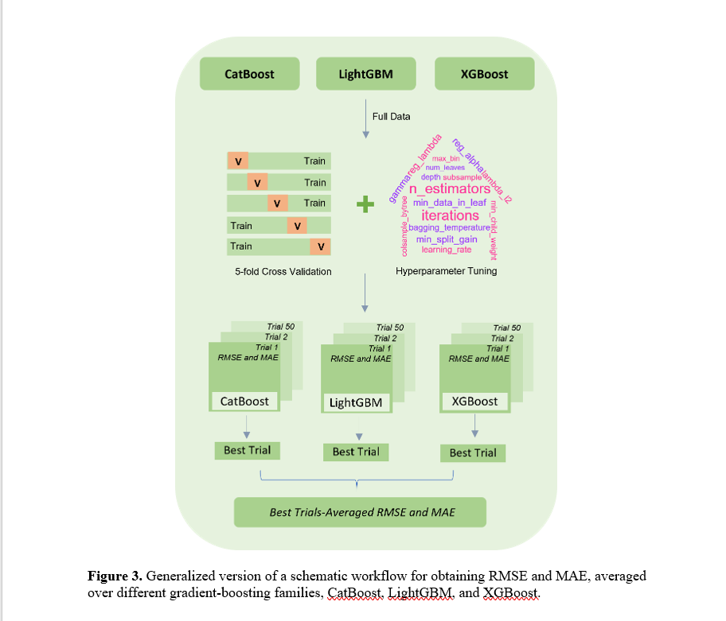

# Machine Learning-Guided Reaction Prediction

Machine learning models to predict outcomes of metal-catalyzed asymmetric reactions using gradient boosting techniques.

---

## 🔬 Problem Statement

Experimental optimization of asymmetric catalytic reactions is time-consuming and relies heavily on trial-and-error.

This project applies machine learning to predict reaction outcomes and guide experimental design in a data-driven manner.

---

## ⚙️ Approach

- Data preprocessing and feature engineering  
- Feature selection using SHAP analysis  
- Model training using gradient boosting algorithms  
- Hyperparameter tuning with cross-validation  
- Model evaluation using RMSE  

---

## 🔁 Workflow

---

## 🤖 Models Used

- CatBoost  
- LightGBM  
- XGBoost  

---

## 📊 Results

- RMSE achieved: **~4.2 – 6.5**  
- Reduced feature space to key molecular descriptors  
- Generated **1500+ novel reaction predictions**  
- Identified high-confidence candidates for experimental validation  

---

## 📄 Abstract

Transition metal-catalyzed asymmetric transformation is a powerful tool for synthesizing structurally complex molecular motifs relevant to drug discovery. However, optimizing such reactions experimentally is resource-intensive.

This project applies machine learning and statistical modeling to predict reaction outcomes in Rh-catalyzed Suzuki-Miyaura coupling systems. Using gradient boosting models and SHAP-based feature selection, a reduced feature space of 34 molecular descriptors was identified.

The final models achieved RMSE in the range of ~4.2–6.5 and enabled the discovery of 1500+ potential reaction combinations, including high-confidence candidates for enantiopure product formation under mild conditions.

---

## 🚀 Impact

- Reduced reliance on trial-and-error experimentation  
- Enabled data-driven reaction optimization  
- Provided interpretable insights into catalytic systems  

---

## 🔗 Code Access

Due to research collaboration constraints, the full implementation and datasets are hosted on an institutional server.

Access can be provided upon request.

---

## ⚠️ Note

This work is part of a research manuscript currently under review at ACS Catalysis.

The repository contains representative code and analysis for demonstration purposes.

---

## 👨‍💻 Author

Vejendla Sharmil Srivathsa  
Co-author | Machine Learning & Data Analysis
